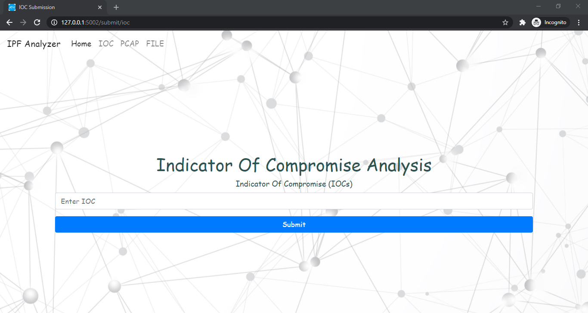
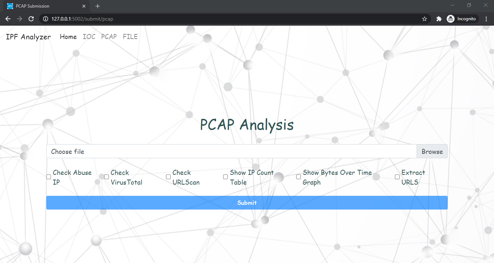
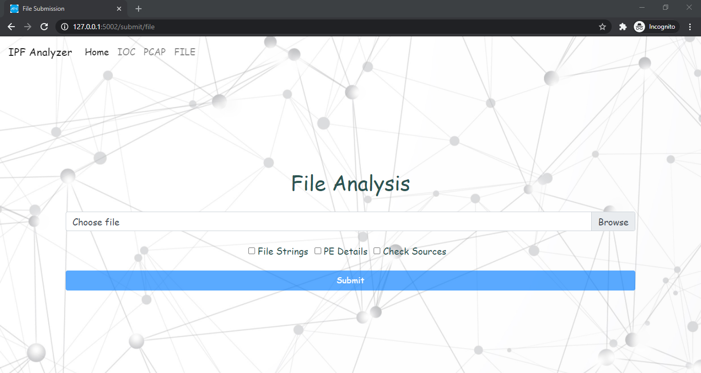

# ipf-analyzer

The flask app accepts IOC (Indicator of Compromise), PCAP (Network Traffic), File in the respective tab
and can process the input.

## Tabs Information
### IOC Tab
The tab accepts any type of IOC and then submits the IOC on the bases of type
to the desired engines which include VirusTotal, Hybrid Analysis, Abuse IP, 
MalShare, URLScan, Valhalla  

### PCAP Tab
The tab accepts a network traffic capture file with the extension of .pcap,
1. Extract IPs from PCAP
2. Extract Public IPs from PCAP
3. Extract URLs from PCAP
4. Get the network traffic graph between data (bytes) and time
5. Submit the IPs to the desired engines which include VirusTotal, Abuse IP, URLScan  

### File Tab
The tab accepts any type of file,
1. Extract file strings
2. Extract PE information, if file is a valid PE
3. Submit the sha256 of file to the desired engines which include VirusTotal, Hybrid Analysis, Abuse IP, 
MalShare, URLScan, Valhalla

   
## Requirements
>Python3.6+
> 
> pip install -r requirements.txt

## Usage
1. You can get the API keys from the sites and then add the api keys in:
    > /common/apiKeys.py
    
    If no keys are present then the submission into the engines will not take place.

2. After this you can modify the `config.ini`, if you want to 
change the sever host and port. Default is set to `localhost:5002`

3. Now run the invoker script to start the flask app,
    >python invoker.py

## Contribution
Any kind of contributions are welcome
1. Fork the project
2. Commit your changes
3. Open a pull request

